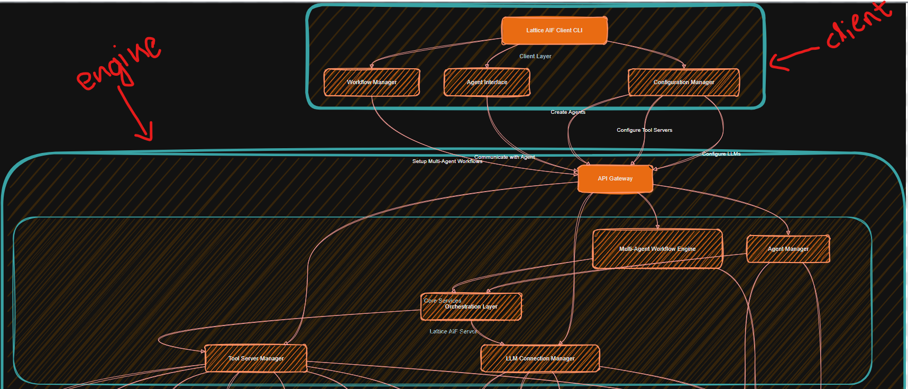

  

Welcome to Lattice AIF, an AI framework for building intelligent applications.

## Lattice-AIF: New AI framework to create Agents

Lattice-AIF is an agentic framework and platform designed to build, deploy, and manage intelligent AI agents with minimum effort. LatticeAI Engine provides a unified abstraction layer over diverse Large Language Models (LLMs) and external tools, empowering you to create robust, actionable AI solutions with unprecedented flexibility. The client-server architecture is inspired from Docker client and Docker engine, helps to scale and mange the Agents.

## HLD architecture diagram

## ✨ Why Lattice-AIF?

In a world of fragmented AI capabilities, LatticeAI brings order and efficiency:

* **LLM Agnostic:** Seamlessly integrate and switch between any LLM – from cloud-based powerhouses like Google Gemini and OpenAI to local, privacy-focused models like Ollama.
* **Robust Tool-Calling:** Extend LLM capabilities beyond text generation. Connect your agents to any API, database, or internal system to perform real-world actions.
* **Agent Orchestration:** Build complex, multi-step, multi-LLM agent workflows with ease, and manage their entire lifecycle.
* **Lattice Engine:** Inspired by Docker Engine, the arch is designed to benefit from a continuously running, daemonized "Lattice Engine" that provides production-grade reliability, scalability, and resource management for your agents.
* **Developer-Friendly:** Easily convert your existing Automation and Applications into AI tools without much workload alongside MCP servers.
* **User-Friendly:** Simple and intuitive CLI interface for easy interaction with the agents.
* **Memory Management:** Have a inbuilt memory management layer for the Agents.
* **logging & Token Management:** Have a inbuilt logging and token management layer for the Agents.

## 📦 Package Structure

Lattice-AIF is organized into three core packages to ensure modularity and scalability:

- [**lattice-engine**](file:///home/pharsha/lattice-aif/lattice-engine/README.md): The core orchestration layer, which manages multiple connections to llm servers both cloud and local and also manage the tool/MCP servers. It acts as a interface between the client and the tools/llms.
- [**lattice-client**](file:///home/pharsha/lattice-aif/lattice-client/README.md): The CLI layer for the user to interact with the engine. This package also includes a small streamlit UI application for demo. A standard UI web/desktop application is available as a seperate project([lattice-ui](https://github.com/trellisAI/lattice-ui)).
- [**lattice-server**](file:///home/pharsha/lattice-aif/lattice-server/README.md): A lightweight utility for registering and exposing tools for agents. This provides a simple interface to expose tools to the engine using decorators to wrap existing python functions and classes. It provides alternative to MCP servers.

## 📖 Documentation

Our comprehensive documentation covers everything from installation and configuration to advanced agent development and deployment strategies.

**[Explore the Docs](https://trellisai.github.io/lattice-aif/docs.html)**

## Other
Lattice AIF is a work in progress. It is not production ready. It is part of a larger project called TrellisAI, under which we have LatticeUI, shadow, and haze.

[shadow](https://github.com/trellisAI/shadow) is agent management tool, which is used to install, deploy, and manage the agents. its more like a pip/npm for agents.

[haze](https://github.com/trellisAI/Haze) is a software for local homelab setup. it helps you to set up the homelab with both defined hardware and software.

[LatticeUI](https://github.com/trellisAI/lattice-ui) is a UI interface for all the above applications. It is for end users with simple UI to manage agents, hardware,tools, and flows.

## 🤝 Contributing

We welcome contributions from the community! Whether it's code, documentation, or ideas, your input is valuable. Please see our [CONTRIBUTING.md](CONTRIBUTING.md) for guidelines.

Join our community to connect with other developers, get support, and contribute to LatticeAI's growth:

* **GitHub Issues:** Report bugs or suggest features.
* **Discussions :** Ask questions and engage with the community.
* **Discord (Coming Soon):** Real-time chat.

## 📄 License

Lattice-AIF(TrellisAI Product) is released under the [MIT License](LICENSE).